<div align="center">


<h1>Internal Marketplace</h1>

<p><strong>The Institutional-Grade Platform for Standardized, Governed, and Self-Service Developer Enablement Across Multi-Cloud Environments.</strong></p>

[]()
[]()
[]()

<br/>

> **"Self-service is the highest form of platform engineering."** 
> **Internal Marketplace** is an enterprise-grade platform designed to provide a secure, measurable, and highly automated foundation for global developer operations. It orchestrates the complex lifecycle of platform services—from standardized "Golden Path" publishing and self-service discovery to automated multi-cloud provisioning and unified catalog governance.

</div>

---

## 🏛️ Executive Summary

Fragmented infrastructure provisioning and manual ticketing processes are strategic operational liabilities; lack of centralized platform orchestration is a primary barrier to organizational developer velocity. Organizations fail to achieve rapid product delivery not because of a lack of talent, but because of fragmented service standards, lack of automated provisioning validation, and an inability to orchestrate internal services with operational precision.

This platform provides the **Platform Intelligence Plane**. It implements a complete **Enterprise Marketplace-as-Code Framework**, enabling Platform and Engineering teams to manage global developer services as first-class citizens. By automating the creation of pre-approved blueprints through "Golden Paths" and orchestrating real-time Terraform/Bicep deployments, we ensure that every organizational service—from routine database instances to complex microservice environments—is discoverable by default, audited for history, and strictly aligned with institutional platform frameworks.

---

## 📐 Architecture Storytelling: Principal Reference Models

### 1. Principal Architecture: Global Internal Marketplace & Platform Intelligence Plane
This diagram illustrates the end-to-end flow from service publishing and discovery to automated provisioning, lifecycle management, and institutional marketplace auditing.

```mermaid
graph LR
    %% Subgraph Definitions
    subgraph CatalogIngress["Service & Blueprint Ingress"]
        direction TB
        CloudTemplates["Terraform / Bicep Modules"]
        AppBlueprints["Standard Microservice Blueprints"]
        DataProducts["Data-as-a-Service Catalog"]
    end

    subgraph IntelligenceEngine["Platform Intelligence Hub"]
        direction TB
        API["FastAPI Marketplace Gateway"]
        OrchestrationHub["Provisioning & Callback Orch"]
        GovernanceLogic["Catalog Governance & RBAC"]
        FederationBot["Distributed Catalog Sync"]
    end

    subgraph ProvisioningPlane["Distributed Deployment Fleet"]
        direction TB
        IaC_Workers["Terraform / Bicep Workers"]
        MeshNodes["Service Mesh Coordinators"]
        DriftDetectors["Blueprint Alignment Bots"]
    end

    subgraph OperationsHub["Institutional Marketplace Hub"]
        direction TB
        Scorecard["Marketplace Maturity Score"]
        Analytics["Provisioning & Reuse Stats"]
        Audit["Forensic Marketplace Metadata Lake"]
    end

    subgraph DevOps["Marketplace-as-Code Framework"]
        direction TB
        TF["Terraform Marketplace Modules"]
        CostBot["Chargeback & Cost Attribution"]
        ChatOps["Service Approval Hub"]
    end

    %% Flow Arrows
    CatalogIngress -->|1. Publish Blueprint| API
    API -->|2. Federate Catalog| FederationBot
    FederationBot -->|3. Validate Governance| GovernanceLogic
    GovernanceLogic -->|4. Orchestrate Provisioning| OrchestrationHub
    
    OrchestrationHub -->|5. Execute Deployment| ProvisioningPlane
    ProvisioningPlane -->|6. Notify Success| ChatOps
    API -->|7. Visualize Adoption| Scorecard
    
    Scorecard -->|8. Track Reuse| Analytics
    Scorecard -->|9. Record Order| Audit
    
    TF -->|10. Provision Hub| IntelligenceEngine
    CostBot -->|11. Inject Cost Attribution| OrchestrationHub
    Audit -->|12. Improve Blueprint| GovernanceLogic

    %% Styling
    classDef ingress fill:#f5f5f5,stroke:#616161,stroke-width:2px;
    classDef intel fill:#e8eaf6,stroke:#1a237e,stroke-width:2px;
    classDef provisioning fill:#e1f5fe,stroke:#01579b,stroke-width:2px;
    classDef ops fill:#ede7f6,stroke:#311b92,stroke-width:2px;
    classDef devops fill:#e8f5e9,stroke:#1b5e20,stroke-width:2px;

    class CatalogIngress ingress;
    class IntelligenceEngine intel;
    class ProvisioningPlane provisioning;
    class OperationsHub ops;
    class DevOps devops;
```

### 2. The Service Discovery & Lifecycle Flow
The continuous path of a platform service from initial publishing and discovery to active provisioning, ongoing management, and institutional forensic auditing.

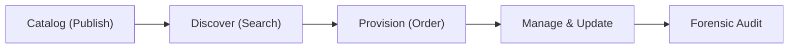

### 3. Cross-Platform Service Mesh Topology
Strategically connecting multi-cloud services (AWS, Azure, GCP) through a unified marketplace entry point, providing a unified institutional view of the global service mesh.

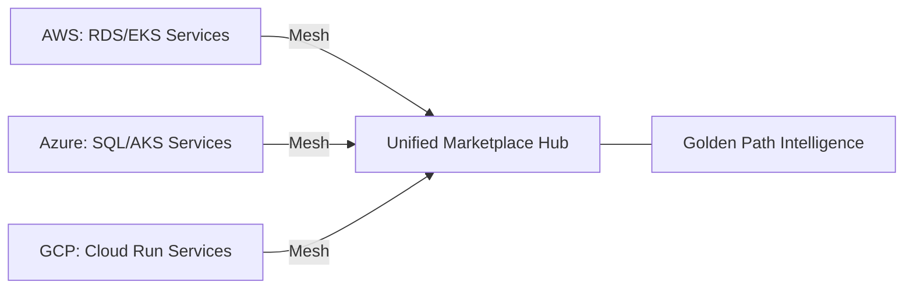

### 4. Distributed Catalog Federation & Sync Flow
Aggregating and synchronizing service catalogs from different business units and geographic regions into a single, governed marketplace, ensuring institutional visibility.

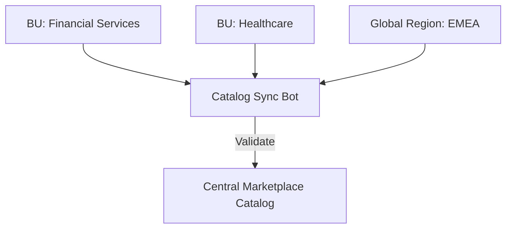

### 5. Provisioning Orchestration & Callback Flow
Managing complex multi-stage provisioning workflows—including IaC execution, DNS updates, and security scanning—with real-time status callbacks to the marketplace.

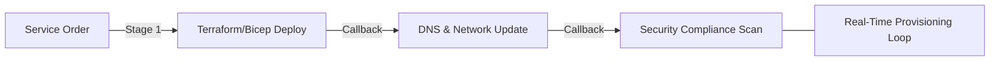

### 6. Institutional Marketplace Maturity Scorecard
Grading organizational performance based on key indicators: Service Reuse Rate, Provisioning Velocity, and Catalog Blueprint Alignment.

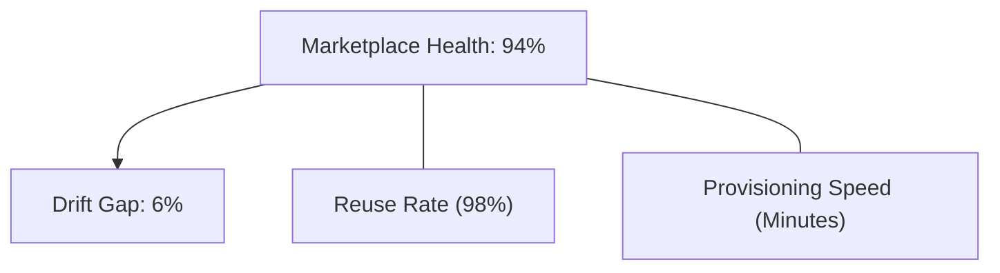

### 7. Identity & RBAC for Marketplace Governance
Managing fine-grained access to service blueprints, provisioning triggers, and order history between Service Providers, Consumers, and Auditors.

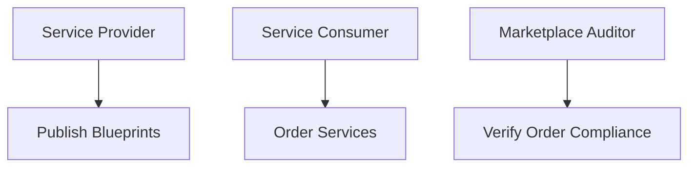

### 8. IaC Deployment: Marketplace-as-Code Framework
Using modular Terraform to deploy and manage the versioned distribution of the marketplace tracking hubs, deployment workers, and forensic metadata lakes.

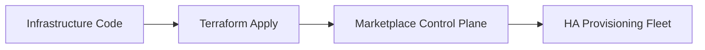

### 9. AIOps Catalog Drift & Alignment Validation Flow
Using advanced analytics to identify services that have deviated from their original "Golden Path" blueprint or where manual changes have introduced institutional risk.

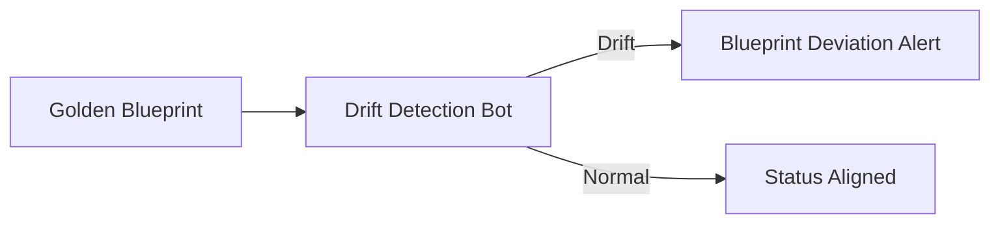

### 10. Metadata Lake for Forensic Marketplace Audit
Storing long-term records of every service ordered, every user interaction, and every provisioning result for institutional record-keeping, compliance auditing, and post-order forensics.

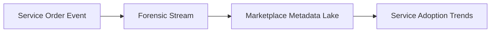

### 11. Cost Attribution & Chargeback Flow
Automatically mapping the infrastructure costs of provisioned services back to the individual consumers and teams, ensuring institutional financial accountability.

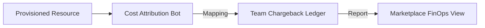

---

## 🏛️ Core Marketplace Pillars

1.  **Unified Service Coordination**: Maximizing velocity by centralizing all service discovery through a single institutional plane.
2.  **Automated Blueprint Validation**: Eliminating "fragile service" scenarios through proactive blueprint and policy verification.
3.  **Sequential Provisioning Intelligence**: Ensuring zero-interruption delivery through dependency-aware multi-stage deployments.
4.  **Zero-Trust Platform Protection**: Automatically enforcing RBAC and security scanning across all provisioned services.
5.  **Autonomous Catalog Federation**: Guaranteeing service availability through automated cross-BU catalog synchronization.
6.  **Full Marketplace Auditability**: Immutable recording of every service order and deployment result for institutional forensics.

---

## 🛠️ Technical Stack & Implementation

### Marketplace Engine & APIs
*   **Framework**: Python 3.11+ / FastAPI.
*   **Provisioning Core**: Integration with Terraform, Bicep, and Kubernetes Operators.
*   **Catalog Hub**: Custom Python-based logic for service federation and lifecycle management.
*   **Persistence**: PostgreSQL (Marketplace Ledger) and Redis (Live Provisioning State).
*   **Auth Orchestrator**: Federated OIDC/SAML for least-privilege marketplace management access.

### Platform Dashboard (UI)
*   **Framework**: React 18 / Vite.
*   **Theme**: Dark, Indigo, Violet (Modern high-fidelity platform aesthetic).
*   **Visualization**: D3.js for service topologies and Recharts for provisioning analytics.

### Infrastructure & DevOps
*   **Runtime**: AWS EKS or Azure Kubernetes Service (AKS) for management plane.
*   **Worker Fleet**: Distributed IaC runners (Terraform Cloud / GitHub Actions).
*   **IaC**: Modular Terraform for deploying the marketplace landing zone and worker fleet.

---

## 🏗️ IaC Mapping (Module Structure)

| Module | Purpose | Real Services |
| :--- | :--- | :--- |
| **`infrastructure/market_hub`** | Central management plane | EKS, PostgreSQL, Redis |
| **`infrastructure/workers`** | Distributed IaC deployment fleet | Terraform, Bicep, GitHub |
| **`infrastructure/federation`** | Multi-BU catalog sync engine | Python Workers, API Sync |
| **`infrastructure/auditing`** | Forensic marketplace sinks | S3, Athena, Quicksight |

---

## 🚀 Deployment Guide

### Local Principal Environment
```bash
# Clone the marketplace platform
git clone https://github.com/devopstrio/internal-marketplace.git
cd internal-marketplace

# Configure environment
cp .env.example .env

# Launch the Marketplace stack
make init

# Trigger a mock service order and automated provisioning simulation
make simulate-marketplace
```

Access the Marketplace Hub at `http://localhost:3000`.

---

## 📜 License
Distributed under the MIT License. See `LICENSE` for more information.

---
<div align="center">
  <p>© 2026 Devopstrio. All rights reserved.</p>
</div>
