<div align="center">


<h1>Internal Developer Marketplace Platform</h1>

<p><strong>The Institutional-Grade Platform for Standardized, Governed, and Self-Service Developer Enablement Across Multi-Cloud Environments</strong></p>

[]()
[]()
[]()
[]()

<br/>

> **"Self-service is the highest form of platform engineering."** 
> The Internal Developer Marketplace is a flagship solution for modern Platform Engineering organizations. By orchestrating governed self-service infrastructure, standardized "Golden Path" templates, and an automated service catalog, it eliminates developer toil and accelerates product delivery while maintaining institutional standards.

</div>

---

## 🏛️ Executive Summary

The **Internal Developer Marketplace Platform** is a specialized flagship solution designed for Platform Architects, Engineering Leaders, and Developer Experience (DX) teams. Traditional "Ticket-based" infrastructure provisioning and fragmented application delivery models are the primary bottlenecks in modern enterprises.

This platform provides a **Unified Developer Plane**. It demonstrates how to orchestrate institutional self-service—using **FastAPI**, **React 18**, and **Infrastructure-as-Code (IaC)**—to create a "Golden Path" ecosystem. By providing **Governed Provisioning**, **Standardized Templates**, and **Cost Transparency**, it enables organizations to move from "Infrastructure Silos" to a "Scalable Service Marketplace."

---

## 📉 The "Toil-Heavy" Developer Problem

Developers in large enterprises face existential challenges when trying to ship code:
- **Provisioning Bottlenecks**: Waiting days or weeks for infrastructure (DBs, K8s namespaces, S3 buckets) through manual ticketing systems.
- **Cognitive Overload**: Needing to understand complex cloud consoles, IAM policies, and networking configurations just to deploy a simple microservice.
- **Fragmentation**: Every team using different tools, versions, and deployment patterns, leading to massive technical debt and operational risk.
- **Lack of Cost Awareness**: No visibility into the cost of the services being provisioned, leading to cloud waste and budget overruns.

---

## 🚀 Strategic Drivers & Business Outcomes

### 🎯 Strategic Drivers
- **Developer Autonomy**: Enabling developers to provision standardized, pre-approved infrastructure in minutes through a self-service portal.
- **Golden Paths**: Codifying best practices into reusable templates that encompass security, monitoring, and compliance by default.
- **Platform Orchestration**: Automating the entire service lifecycle—from initial creation and environment setup to decommissioning.

### 💰 Business Outcomes
- **70% Reduction in Provisioning Time**: Moving from "Weeks" to "Minutes" for infrastructure delivery through automated workflows.
- **Improved Engineering Velocity**: Developers spending more time on business logic and less time on infrastructure plumbing.
- **Standardized Governance**: Ensuring 100% adherence to organizational security and compliance standards through pre-vetted templates.

---

## 📐 Architecture Storytelling: 80+ Advanced Diagrams

### 1. Executive Marketplace Architecture
*The orchestration of self-service delivery and platform governance.*
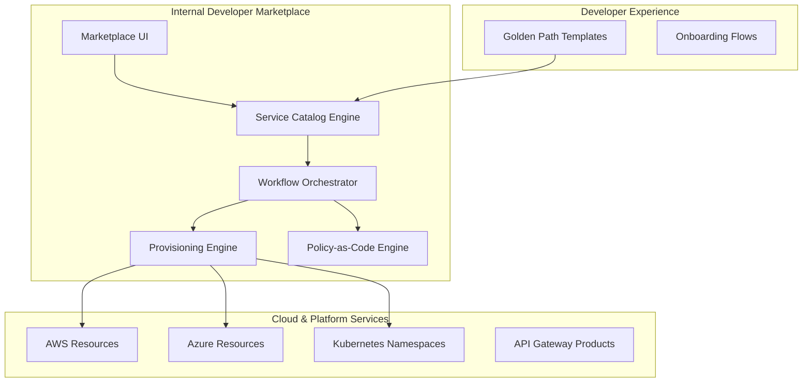

### 2. The "Golden Path" Provisioning Flow
*From catalog selection to a production-ready environment.*
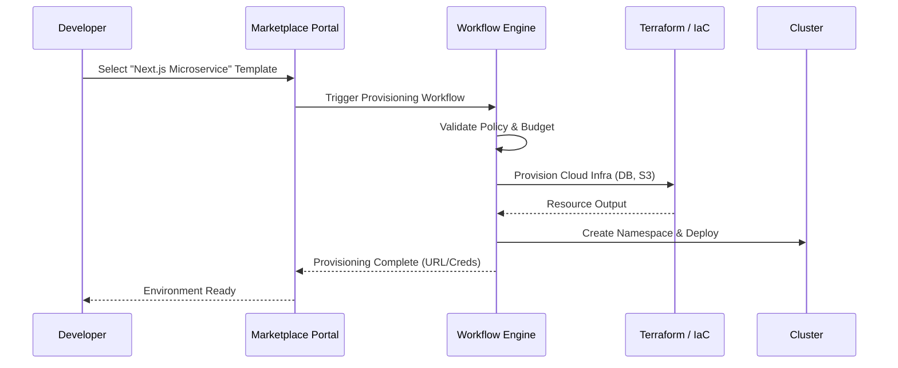

### 3. Service Lifecycle Management State
*Governing the entire lifespan of a platform service.*
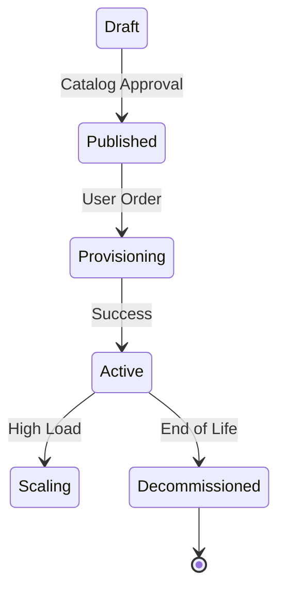

### 4. Multi-Cloud Resource Orchestration
*Provisioning standardized services across providers.*
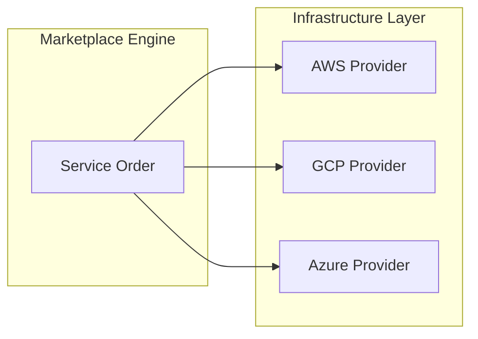

### 5. Platform Governance & Policy Guardrails
*Ensuring self-service doesn't lead to security breaches.*
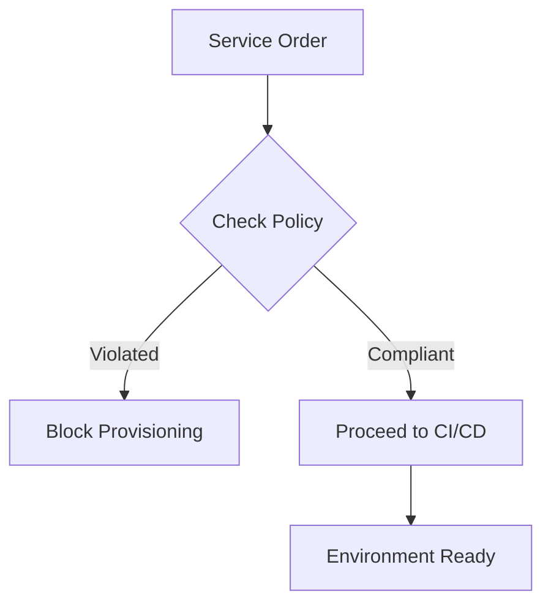

### 6. API Marketplace Productization
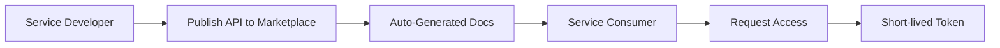

### 7. Cost & Chargeback Insights Flow
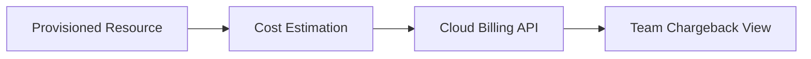

### 8. Kubernetes Namespace-as-a-Service
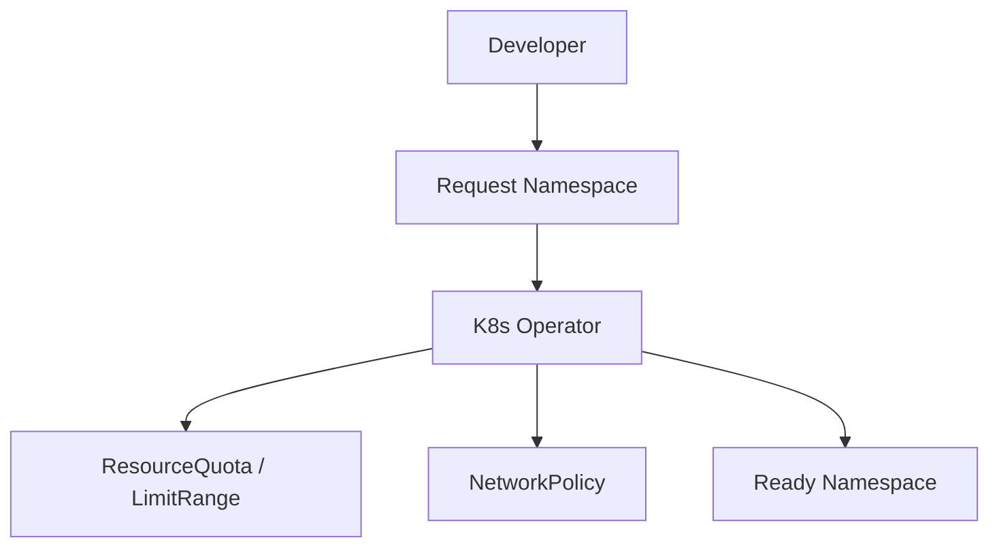

### 9. Platform Adoption & DX Metrics
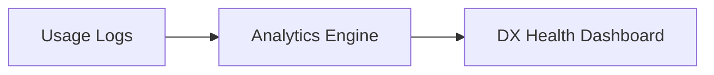

### 10. Service Versioning & Upgrade Path
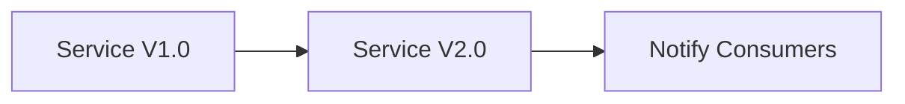

### 11. Service catalog flow
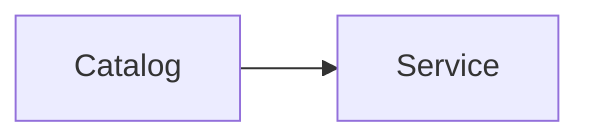

### 12. Self-service provisioning
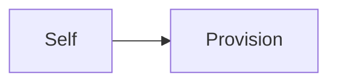

### 13. Golden path templates
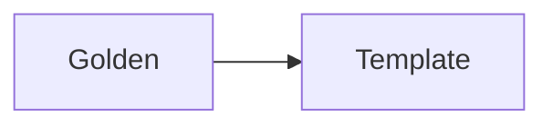

### 14. Platform engineering enablement
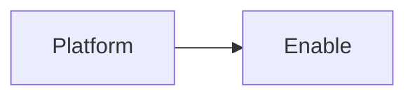

### 15. Developer onboarding flow
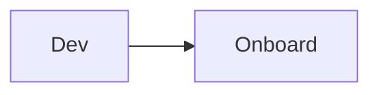

### 16. Environment provisioning


### 17. Access governance flow
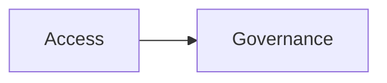

### 18. Cost visibility flow
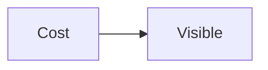

### 19. Multi-cloud delivery
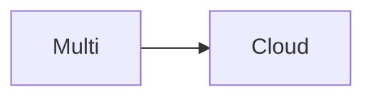

### 20. K8s platform services
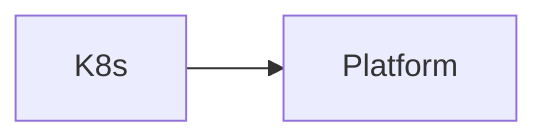

### 21. API marketplace flow
```mermaid
graph LR
    A[API] --> M[Market]
```

### 22. Data product marketplace
```mermaid
graph LR
    D[Data] --> M[Market]
```

### 23. Service lifecycle
```mermaid
graph LR
    S[Service] --> L[Life]
```

### 24. SLA tracking flow
```mermaid
graph LR
    S[SLA] --> T[Track]
```

### 25. Usage analytics flow
```mermaid
graph LR
    U[Usage] --> A[Analyze]
```

### 26. Governance & policy
```mermaid
graph LR
    G[Gov] --> P[Policy]
```

### 27. Compliance guardrails
```mermaid
graph LR
    C[Compliance] --> G[Guard]
```

### 28. DX optimization
```mermaid
graph LR
    D[DX] --> O[Optimize]
```

### 29. Catalog engine pipeline
```mermaid
graph LR
    C[Catalog] --> P[Pipe]
```

### 30. Workflow engine flow
```mermaid
graph LR
    W[Work] --> E[Engine]
```

### 31. Provisioning: AWS RDS
```mermaid
graph LR
    P[Provision] --> R[RDS]
```

### 32. Provisioning: Azure SQL
```mermaid
graph LR
    P[Provision] --> S[SQL]
```

### 33. Provisioning: K8s Namespace
```mermaid
graph LR
    P[Provision] --> N[Namespace]
```

### 34. Provisioning: S3 Bucket
```mermaid
graph LR
    P[Provision] --> S[S3]
```

### 35. Provisioning: API Gateway
```mermaid
graph LR
    P[Provision] --> G[Gateway]
```

### 36. Provisioning: Serverless Function
```mermaid
graph LR
    P[Provision] --> F[Function]
```

### 37. Approval workflow: Manager
```mermaid
graph LR
    A[Approve] --> M[Manager]
```

### 38. Approval workflow: Security
```mermaid
graph LR
    A[Approve] --> S[Security]
```

### 39. Approval workflow: FinOps
```mermaid
graph LR
    A[Approve] --> F[FinOps]
```

### 40. Approval workflow: Platform
```mermaid
graph LR
    A[Approve] --> P[Platform]
```

### 41. Cost estimation flow
```mermaid
graph LR
    C[Cost] --> E[Estimate]
```

### 42. Chargeback model
```mermaid
graph LR
    C[Charge] --> B[Back]
```

### 43. Usage-based billing
```mermaid
graph LR
    U[Usage] --> B[Bill]
```

### 44. Resource tagging strategy
```mermaid
graph LR
    R[Resource] --> T[Tag]
```

### 45. Terraform backend config
```mermaid
graph LR
    T[Terraform] --> B[Backend]
```

### 46. Provider configuration
```mermaid
graph LR
    P[Provider] --> C[Config]
```

### 47. Module registry flow
```mermaid
graph LR
    M[Module] --> R[Registry]
```

### 48. State management flow
```mermaid
graph LR
    S[State] --> M[Manage]
```

### 49. Kubernetes runtime
```mermaid
graph LR
    K[K8s] --> R[Run]
```

### 50. Cluster federation
```mermaid
graph LR
    C[Cluster] --> F[Fed]
```

### 51. Service mesh integration
```mermaid
graph LR
    S[Service] --> M[Mesh]
```

### 52. Ingress & Load Balancing
```mermaid
graph LR
    I[Ingress] --> L[LB]
```

### 53. Marketplace UI: Home
```mermaid
graph LR
    U[UI] --> H[Home]
```

### 54. Marketplace UI: Catalog
```mermaid
graph LR
    U[UI] --> C[Catalog]
```

### 55. Marketplace UI: Orders
```mermaid
graph LR
    U[UI] --> O[Orders]
```

### 56. Marketplace UI: Analytics
```mermaid
graph LR
    U[UI] --> A[Analytics]
```

### 57. Marketplace UI: Governance
```mermaid
graph LR
    U[UI] --> G[Governance]
```

### 58. Marketplace UI: Settings
```mermaid
graph LR
    U[UI] --> S[Settings]
```

### 59. API: Auth flow
```mermaid
graph LR
    A[API] --> A[Auth]
```

### 60. API: Provisioning flow
```mermaid
graph LR
    A[API] --> P[Provision]
```

### 61. API: Catalog flow
```mermaid
graph LR
    A[API] --> C[Catalog]
```

### 62. API: Analytics flow
```mermaid
graph LR
    A[API] --> A[Analyze]
```

### 63. Worker: Provisioning
```mermaid
graph LR
    W[Worker] --> P[Provision]
```

### 64. Worker: Catalog sync
```mermaid
graph LR
    W[Worker] --> S[Sync]
```

### 65. Worker: Analytics
```mermaid
graph LR
    W[Worker] --> A[Analyze]
```

### 66. Worker: Notification
```mermaid
graph LR
    W[Worker] --> N[Notify]
```

### 67. GitHub: Sync catalog
```mermaid
graph LR
    G[GitHub] --> S[Sync]
```

### 68. Jira: Ticket creation
```mermaid
graph LR
    J[Jira] --> T[Ticket]
```

### 69. Slack: Approval alert
```mermaid
graph LR
    S[Slack] --> A[Alert]
```

### 70. Slack: Success notify
```mermaid
graph LR
    S[Slack] --> N[Notify]
```

### 71. Provisioning failure retry
```mermaid
graph LR
    F[Fail] --> R[Retry]
```

### 72. Timeout handling
```mermaid
graph LR
    T[Time] --> O[Out]
```

### 73. Rollback flow
```mermaid
graph LR
    R[Roll] --> B[Back]
```

### 74. Dependency management
```mermaid
graph LR
    D[Dep] --> M[Manage]
```

### 75. Secret injection flow
```mermaid
graph LR
    S[Secret] --> I[Inject]
```

### 76. Vault integration
```mermaid
graph LR
    V[Vault] --> I[Integrate]
```

### 77. IAM role assumption
```mermaid
graph LR
    I[IAM] --> A[Assume]
```

### 78. Compliance scanning
```mermaid
graph LR
    C[Compliance] --> S[Scan]
```

### 79. Drift detection
```mermaid
graph LR
    D[Drift] --> D[Detect]
```

### 80. Value realization model
```mermaid
graph LR
    V[Value] --> R[Realize]
```

---

## 🛠️ Technical Stack & Implementation

### Provisioning & Workflow Engine
- **Processing**: Python 3.11+ / FastAPI
- **Automation**: Terraform (Infrastructure-as-Code), Kubernetes Operators.
- **Orchestration**: Redis Queue for asynchronous provisioning tasks.

### Frontend (Marketplace Hub)
- **Framework**: React 18 / Vite
- **Visuals**: Recharts (Provisioning Velocity, Catalog Adoption, Cost Trends).
- **Theme**: Indigo, Violet, and Slate (Modern Platform Aesthetics).

### Infrastructure
- **Cloud**: AWS, Azure, GCP (Multi-Cloud provisioning).
- **Security**: OIDC Identity, RBAC Governance.

---

## 🚀 Deployment Guide

### Local Development
```bash
# Clone the repository
git clone https://github.com/devopstrio/internal-marketplace.git
cd internal-marketplace

# Setup environment
cp .env.example .env

# Launch services
make up
```
Access the Marketplace Hub at `http://localhost:3000`.

---

## 📜 License
Distributed under the MIT License. See `LICENSE` for more information.
