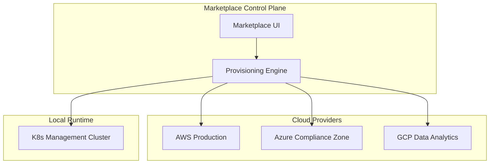
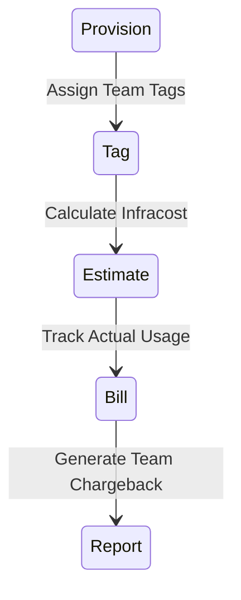

# Architecture & Platform Diagrams

## 11. Multi-Cloud Provisioning Topology (Detailed)
*How the marketplace orchestrates resources across cloud boundaries.*



## 13. "Golden Path" Onboarding Lifecycle
```mermaid
graph LR
    User[New Developer] --> Template[Select Golden Path]
    Template --> Provision[Automated Environment Setup]
    Provision --> Deploy[First "Hello World" Deployment]
    Deploy --> Verify[Platform Health Check]
```

## 20. Chargeback & Cost Allocation Model

