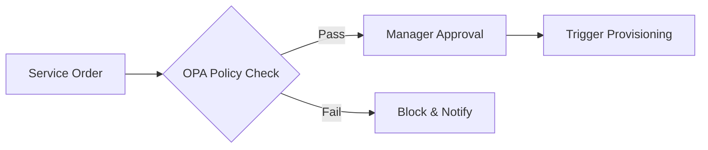
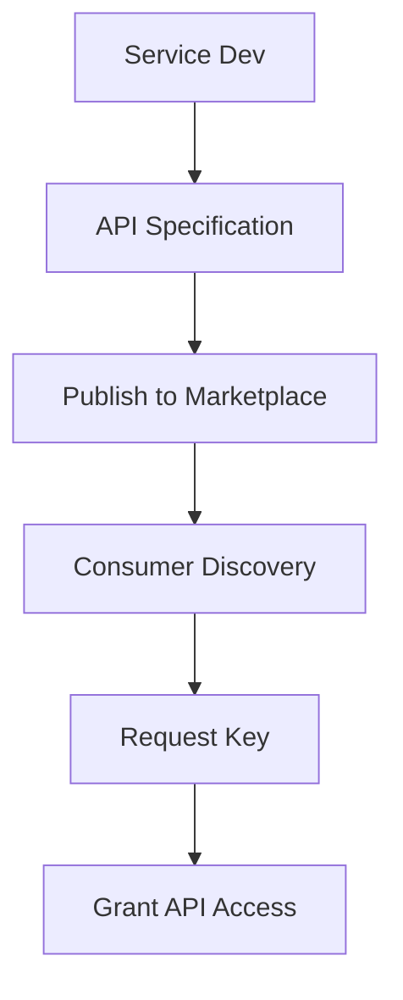
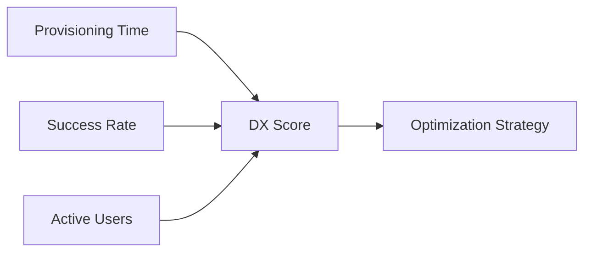

# Governance & DX Diagrams

## 31. Platform Governance Gateways

```mermaid
graph LR
    Order[Service Order] --> Policy{OPA Policy Check}
    Policy -->|Pass| Approval[Manager Approval]
    Policy -->|Fail| Block[Block & Notify]
    Approval --> Provision[Trigger Provisioning]
```

## 34. API Product Lifecycle

```mermaid
graph TD
    Dev[Service Dev] --> Spec[API Specification]
    Spec --> Publish[Publish to Marketplace]
    Publish --> Discover[Consumer Discovery]
    Discover --> Request[Request Key]
    Request --> Access[Grant API Access]
```

## 40. Developer Experience (DX) Scoring Model

```mermaid
graph LR
    Time[Provisioning Time] --> Score[DX Score]
    Success[Success Rate] --> Score
    Usage[Active Users] --> Score
    Score --> Insights[Optimization Strategy]
```
